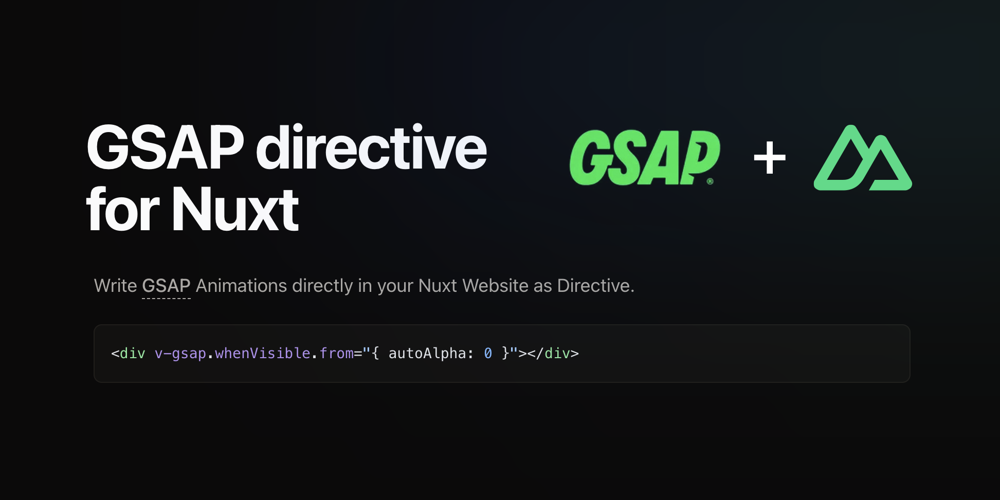

# `v-gsap` for Nuxt (and Vue)

[![npm version][npm-version-src]][npm-version-href]
[![npm downloads][npm-downloads-src]][npm-downloads-href]
[![License][license-src]][license-href] [![Nuxt][nuxt-src]][nuxt-href]



## Quick Setup

Install the module to your Nuxt application with one command:

```bash
npx nuxi module add v-gsap-nuxt
```

That's it! You can now use `v-gsap` in your Nuxt app ✨

### Want to use it with Vue? [Learn about Vue usage](https://v-gsap-nuxt.vercel.app/installation/vue.only)

## Docs

### Find the full docs and examples here:

[Documentation](https://v-gsap-nuxt.vercel.app/)

---

### GSAP Licensing

GSAP is subject to its own licensing terms. Before incorporating GSAP with
`v-gsap-nuxt` (as dependency), ensure you review and comply with the
[GSAP Standard License](https://gsap.com/community/standard-license/).

This module itself is licensed under the MIT License.

---

## Contribution

<details>
  <summary>Local development</summary>
  
  ```bash
  # Install dependencies
  npm install
  
  # Generate type stubs
  npm run dev:prepare
  
  # Develop with the playground
  npm run dev
  
  # Build the playground
  npm run dev:build
  
  # Run ESLint
  npm run lint
  
  # Run Vitest
  npm run test
  npm run test:watch
  
  # Release new version
  npm run release
  ```

</details>

<!-- Badges -->

[npm-version-src]:
  https://img.shields.io/npm/v/v-gsap-nuxt/latest.svg?style=flat&colorA=020420&colorB=00DC82
[npm-version-href]: https://npmjs.com/package/v-gsap-nuxt
[npm-downloads-src]:
  https://img.shields.io/npm/dm/v-gsap-nuxt.svg?style=flat&colorA=020420&colorB=00DC82
[npm-downloads-href]: https://npm.chart.dev/v-gsap-nuxt
[license-src]:
  https://img.shields.io/npm/l/v-gsap-nuxt.svg?style=flat&colorA=020420&colorB=00DC82
[license-href]: https://npmjs.com/package/v-gsap-nuxt
[nuxt-src]: https://img.shields.io/badge/Nuxt-020420?logo=nuxt.js
[nuxt-href]: https://nuxt.com
